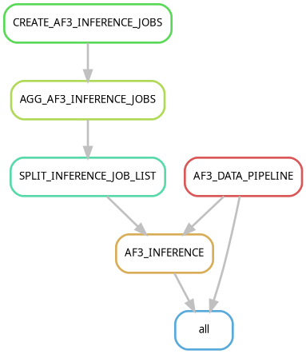

# AlphaFold 3 workflow

A Snakemake workflow for high-throughput AlphaFold 3 predictions



You are currently in branch **'parallel'**.

The workflow implemented in this branch is slightly different than the one in branch **'master'**.

Similar to the workflow in branch **'master'**, this workflow supports separate execution of the **CPU** and **GPU** steps. 
On top of that, it also distributes inference runs across multiple GPU devices using **GNU parallel**.
This is particularly useful when your HPC setup has multi-GPU nodes, but does not support "consumable resources".   


### TO DO
- Add steps for downstream analyses such as relaxation, assembly, binding site prediction, scoring etc. 
- Add a reporting step to the workflow in a form of a table that describe each predicted structure.


## Steps to setup & execute


### 1. Build the Singularity container
Install singularity. See [here](https://github.com/google-deepmind/alphafold3/blob/main/docs/installation.md#install-singularity) or [here](https://docs.sylabs.io/guides/3.3/user-guide/installation.html) for instructions.
Run the following command to build the Singularity container that supports parallel inference runs:

```bash
singularity build alphafold3_parallel.sif docker://ntnn19/alphafold3:latest_parallel_a100_40gb
```

Or

```bash
singularity build alphafold3_parallel.sif docker://ntnn19/alphafold3:latest_parallel_a100_80gb
```

### Notes

Make sure to download the required [AlphaFold3 databases](https://github.com/google-deepmind/alphafold3/blob/main/docs/installation.md#obtaining-genetic-databases) and [weights](https://forms.gle/svvpY4u2jsHEwWYS6) before proceeding.

### 2. Clone This repository

Clone this repository.

```bash
git clone --branch parallel --single-branch https://github.com/ntnn19/AlphaFold3_workflow.git
```

Go to the repository location
```bash
cd AlphaFold3_workflow
```

An example JSON and CSV files are available in the example directory:
example/example.json
example/all_vs_all.csv
example/pulldown.csv
example/virtual_drug_screen.csv

### 3. Create & activate the Snakemake environment

Install [mamba](https://github.com/conda-forge/miniforge) or [micromamba](https://mamba.readthedocs.io/en/latest/installation/micromamba-installation.html) if not already installed.

Then, set up and activate the environment using the following commands:

```bash
mamba env create -p $(pwd)/venv -f environment.yml
mamba activate $(pwd)/venv
```
For Maxwell users

```bash
module load maxwell mamba
. mamba-init
mamba env create -p $(pwd)/venv -f environment.yml
mamba activate $(pwd)/venv
```

Or if using micromamba

```bash
micromamba env create -p $(pwd)/venv -f environment.yml
eval "$(micromamba shell hook --shell=bash)"
micromamba activate $(pwd)/venv
```
### 4. Configure the workflow
Open config/config.yaml with your favorite text editor.
Edit the values to your needs.
#### Mandatory workflow flags:
##### This workflow adapts the input preparation logic from [AlphaFold3-GUI](https://github.com/Hanziwww/AlphaFold3-GUI).
 
-   **output_dir**: <path_to_your_output_directory> # Stores the outputs of this workflow
-   **af3_flags**: # configures AlphaFold 3
     -   **af3_container**: <path_to_your_alphafold3_container> 
- **input_csv**: <path_to_your_csv_table>
-   **tmp_dir**: <path_to_your_tmp_dir> 


For running the default workflow, the user must provide a csv table such as the following:

**default**: example/default.csv

| job_name  | type    | id | sequence        |
|-----------|--------|----|----------------|
| TestJob1  | protein | A  | MVLSPADKTNVKAAW |
| TestJob1  | protein | B  | MVLSPADKTNVKAAW |
| TestJob2  | protein | C  | MVLSPADKTNVKAAW |

##### Explanation:
For explanation and full list of optional columns, see  [AlphaFold3-GUI api tutorial](https://alphafold3-gui.readthedocs.io/en/latest/tutorial.html)

#### Optional workflow flags:
The workflow supports running AlphaFold 3 in different modes:
all-vs-all, pulldown, virtual-drug-screen, or stoichio-screen (TBD)

To run the workflow in a specific mode the user must provide the flag 'mode' in the config/config.yaml file.

For example:
```bash
input_csv: example/virtual_drug_screen_df.csv
output_dir: output
tmp_dir: tmp
mode: virtual-drug-screen
# n_splits: 4  # Optional, for running using the 'parallel' branch of this repo. To maximize resources utilization, the value of this flag should correspond to min(number_of_predictions, number_of_multi-GPU_nodes). 
af3_flags:
  --af3_container: alphafold3_parallel.sif
```


To run the workflow using a custom msa the user must provide the flag 'msa_option' in the config/config.yaml file and set it to 'custom', i.e. msa_option: custom. Setting 'msa_option' to 'custom' would require adding more columns to the input csv tables described below. For more information about this option, see [here](https://alphafold3-gui.readthedocs.io/en/latest/api.html).  

**Examples for supported input_csv files for each mode**:
##### all-vs-all: example/all_vs_all.csv 

| id  | type    | sequence          |
|-----|--------|------------------|
| p1  | rna    | AUGGCA           |
| p2  | protein | MKPSFDR          |
| p3  | protein | MVLSPADKTNVKAAW  |

##### Explanation:
- **id**: A unique identifier for each entry.
- **type**: The biological macromolecule type (protein, dna, or rna).
- **sequence**: The nucleotide or amino acid sequence.


##### virtual drug screen: example/virtual_drug_screen.csv

| id  | type    | sequence                        | drug_or_target | target_id | drug_id |
|-----|--------|---------------------------------|----------------|-----------|---------|
| p2  | protein | MASEQASDTTVCIK                  | target         | t1        |         |
| l1  | ligand  | CC(=O)Oc1ccccc1C(=O)O           | drug           |           | d1      |
| l2  | ligand  | CN1C=NC2=C1C(=O)N(C(=O)N2C)     | drug           |           | d1      |
| p1  | protein | MHIKPEERF                       | target         | t1        |         |
| p3  | protein | ANHIREQDS                       | target         | t2        |         |
| l3  | ligand  | CN1C=NC2                        | drug           |           | d2      |

##### Explanation:
- **id**: A unique identifier for each entry.
- **type**: The type of compound (protein, ligand, etc.).
- **sequence**: The amino acid sequence for proteins or the chemical structure for ligands.
- **drug_or_target**: Indicates whether the compound is a "drug" or "target".
- **Optional columns**: 
  - **target_id**: The identifier for the target.
  - **drug_id**: The identifier for the drug.


**The optional columns can be used to screen single drugs against multimeric targets, multiple drugs against monomeric targets, or multiple drugs against multimeric targets.**


##### pulldown: example/pulldown.csv

| id  | type    | sequence          | bait_or_target | target_id | bait_id |
|-----|--------|------------------|----------------|-----------|---------|
| p2  | protein | MASEQASDTTVCIK   | target         | t2        |         |
| b1  | protein | MASEQASDTTVCIK   | bait           |           | b1      |
| b2  | protein | MASEQASDTTVCIK   | bait           |           | b2      |
| p1  | protein | MHIKPEERF        | target         | t1        |         |
| p3  | protein | ANHIREQDS        | target         | t2        |         |
| b3  | protein | ANHIREQDS        | bait           |           | b1      |

##### Explanation:
- **id**: A unique identifier for each entry.
- **type**: The biological macromolecule type (protein, dna, or rna).
- **sequence**: The nucleotide or amino acid sequence.
- **bait_or_target**: Indicates whether the protein is a "bait" or "target" in the experiment.
- **Optional columns**: 
  - **target_id**: The identifier for the target.
  - **bait_id**: The identifier for the bait.

**The optional columns can be used to pulldown multimeric targets with monomeric baits, multimeric targets with multimeric baits, or monomeric targets with multimeric baits.**


#### Optional AlphaFold3 flags:
Include the optional flags within the scope of the af3_flags.

For flags explanations, run the following command:
```bash
singularity run <path_to_your_alphafold3_singularity_container> \
python /app/alphafold/run_alphafold.py --help
```

The optional flags are:
<details>

--buckets

--conformer_max_iterations

--flash_attention_implementation

--gpu_device

--hmmalign_binary_path

--hmmbuild_binary_path

--hmmsearch_binary_path

--jackhmmer_binary_path

--jackhmmer_n_cpu

--jax_compilation_cache_dir

--max_template_date

--mgnify_database_path

--nhmmer_binary_path

--nhmmer_n_cpu

--ntrna_database_path

--num_diffusion_samples

--num_recycles

--num_seeds

--pdb_database_path

--rfam_database_path

--rna_central_database_path

--save_embeddings

--seqres_database_path

--small_bfd_database_path

--uniprot_cluster_annot_database_path

--uniref90_database_path
</details>

##### Example for a config/config.yaml file with optional AlphaFold 3 flags: 
```bash
input_csv: example/virtual_drug_screen_df.csv
output_dir: output
mode: virtual-drug-screen 
# n_splits: 4  # Optional, for running using the 'parallel' branch of this repo. To maximize resources utilization, the value of this flag should correspond to min(number_of_predictions, number_of_multi-GPU_nodes). 
af3_flags:
  --af3_container: alphafold3_parallel.sif
  --num_diffusion_samples: 5
```
### 5. Configure the profile (Optional)

For running this workflow on HPC using slurm, you can modify profile/config.yaml to make it compatible with your HPC setting.
More details can be found [here](https://snakemake.github.io/snakemake-plugin-catalog/plugins/executor/slurm.html#using-profiles).

### 6. Run the workflow
Information on snakemake flags can be found [here](https://snakemake.readthedocs.io/en/stable/executing/cli.html#)

**Dry run**
```bash
python workflow/scripts/prepare_workflow.py config/config.yaml
snakemake -s workflow/Snakefile \
-j unlimited -c all \
-p -k -w 30 --rerun-triggers mtime -n
```
**Local run**
```bash
python workflow/scripts/prepare_workflow.py config/config.yaml
snakemake -s workflow/Snakefile \
--use-singularity --singularity-args  \
'--nv -B <your_alphafold3_weights_dir>:/root/models -B <your_output_dir>:/root/af_output -B <your_alphafold3_databases_dir>:/root/public_databases -B <your_alphafold3_tmp_dir>:/tmp --env XLA_CLIENT_MEM_FRACTION=3.2' \
-j unlimited -c all \
-p -k -w 30 --rerun-triggers mtime
```

**slurm run**
```bash
python workflow/scripts/prepare_workflow.py config/config.yaml
snakemake -s workflow/Snakefile \
--use-singularity --singularity-args  \
'--nv -B <your_alphafold3_weights_dir>:/root/models -B <your_output_dir>:/root/af_output -B <your_alphafold3_databases_dir>:/root/public_databases -B <your_alphafold3_tmp_dir>:/tmp --env XLA_CLIENT_MEM_FRACTION=3.2' \
-j unlimited -c all \
-p -k -w 30 --rerun-triggers mtime --workflow-profile profile
```
