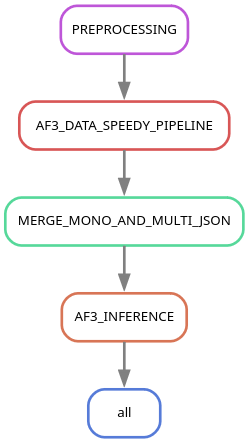

# Snakemake workflow: AlphaFold 3 workflow

A Snakemake workflow for high-throughput AlphaFold 3 structure predictions on HPC systems.

This workflow extends standard AlphaFold 3 with:

1. **Separated data and inference pipelines** — MSA generation and structure prediction run as independent jobs, enabling better resource utilization and result reuse across experiments.
2. **Assemble-from-monomers** — implements the [official AF3 technique](https://github.com/google-deepmind/alphafold3/blob/main/docs/performance.md#pre-computing-and-reusing-msa-and-templates) for multimer prediction: per-chain MSAs are computed once and injected into all multimeric combinations, avoiding redundant computation.
3. **Per-seed parallelism** — each random seed is treated as an independent job, substantially increasing throughput for large-scale sampling campaigns.
4. **HPC whole-node support** (`exclusive_lock`) — batches all inference commands into a job list and dispatches them with GNU `parallel` across all GPUs on a node, designed for schedulers that allocate nodes exclusively rather than by consumable GPU resources.



---

## Table of Contents

- [Run modes](#run-modes)
- [Prerequisites](#prerequisites)
- [Installation](#installation)
- [Configuration](#configuration)
- [Usage](#usage)
  - [Custom predictions](#custom-predictions)
  - [All-vs-all](#all-vs-all)
  - [Pulldown](#pulldown)
  - [Virtual drug screen](#virtual-drug-screen)
  - [Stoichiometry screen](#stoichiometry-screen)
  - [Massive sampling](#massive-sampling)
- [Pipeline entry points](#pipeline-entry-points)
- [Testing](#testing)
- [HPC execution](#hpc-execution)
- [Output structure](#output-structure)
- [Authors](#authors)
- [References](#references)

---

## Run modes

| Mode | Description |
|------|-------------|
| `custom` | Predict each complex exactly as defined in the sample sheet |
| `all-vs-all` | Generate all pairwise combinations (including self-pairs) across all jobs |
| `pulldown` | Pair every `bait` job with every `target` job; skip same-group pairs |
| `virtual-drug-screen` | Ligand-centric screen using a compact format with entity copy counts |
| `stoichio-screen` | Enumerate all Cartesian stoichiometry combinations from per-entity count ranges |

---

## Prerequisites

### Hardware
- NVIDIA GPU with compute capability ≥ 7.0 (Volta or newer). A100 40 GB or 80 GB recommended for large complexes.
- Flash attention is automatically disabled for pre-Ampere GPUs (CC < 8).

### Software
- [Singularity](https://docs.sylabs.io/guides/3.3/user-guide/installation.html) ≥ 3.x
- [Mamba](https://github.com/conda-forge/miniforge) or [Micromamba](https://mamba.readthedocs.io/en/latest/installation/micromamba-installation.html)
- Snakemake ≥ 9.16.3 (installed via the conda environment below)

### AlphaFold 3 data
Before running the workflow, download:
- **Genetic databases**: follow the [AF3 installation guide](https://github.com/google-deepmind/alphafold3/blob/main/docs/installation.md#obtaining-genetic-databases). This is a multi-hour download (~2 TB).
- **Model weights**: request access via [this form](https://forms.gle/svvpY4u2jsHEwWYS6) and download to a local directory.

---

## Installation

```bash
git clone https://github.com/ntnn19/AlphaFold3_workflow.git
cd AlphaFold3_workflow
```

### 1. Create the Snakemake environment

```bash
mamba env create -p $(pwd)/venv -f environment.yml
mamba activate $(pwd)/venv
```

<details>
<summary>Maxwell HPC users</summary>

```bash
module load maxwell mamba
. mamba-init
mamba env create -p $(pwd)/venv -f environment.yml
mamba activate $(pwd)/venv
```
</details>

<details>
<summary>Micromamba users</summary>

```bash
micromamba env create -p $(pwd)/venv -f environment.yml
eval "$(micromamba shell hook --shell=bash)"
micromamba activate $(pwd)/venv
```
</details>

### 2. Obtain the AlphaFold 3 Singularity container

The workflow requires an AF3 Singularity image. You can either pull a pre-built image or let Snakemake build it automatically from the container registry.

**Option A — pull manually** (recommended if you want the image in a specific location):

```bash
# For A100 40 GB nodes:
singularity pull alphafold3_parallel.sif docker://ntnn19/alphafold3:latest_parallel_a100_40gb

# For A100 80 GB nodes:
singularity pull alphafold3_parallel.sif docker://ntnn19/alphafold3:latest_parallel_a100_80gb
```

**Option B — let Snakemake pull automatically**: set `af3_container` to an OCI registry URI, e.g.:
```yaml
af3_flags:
  af3_container: "oras://ghcr.io/<owner>/<image>:<tag>"
```

---

## Configuration

All workflow behaviour is controlled by `config/config.yaml`. A minimal working config:

```yaml
sample_sheets:
  raw_data: example/custom.tsv   # path to your sample sheet

output_dir: results              # where all outputs are written
mode: custom                     # run mode (see Run modes)
msa_option: auto                 # auto | none | upload
n_seeds: 3                       # number of random seeds per job

af3_flags:
  af3_container: /path/to/alphafold3.sif   # required
  models_dir: /path/to/model_params   # required
  databases_dir: /path/to/public_databases   # required
```

For the full parameter reference, all sample sheet formats, MSA/template options, and pipeline entry point schemas, see [`docs/input.md`](docs/input.md).

---

## Usage

All paths (models, databases, output directory, tmp) are set once in `config/config.yaml`. You do not need to pass them on the command line — the workflow reads them from config and sets up Singularity bind mounts automatically.

### Recommended: use the convenience wrapper

```bash
bash run_workflow.sh [config_file] [profile] [extra_snakemake_flags...]
```

| Argument | Default | Description |
|----------|---------|-------------|
| `config_file` | `config/config.yaml` | Path to your config file |
| `profile` | `profiles/local` | Execution profile (`profiles/local` or `profiles/slurm`) |
| extra flags | — | Any additional Snakemake flags (e.g. `--dry-run`) |

### Dry run (always do this first)

```bash
bash run_workflow.sh config/config.yaml profiles/local --dry-run
```

### Local execution

```bash
bash run_workflow.sh config/config.yaml profiles/local
```

### SLURM cluster

```bash
bash run_workflow.sh config/config.yaml profiles/slurm
```

### Direct Snakemake invocation (equivalent)

```bash
snakemake --workflow-profile profiles/local --configfile config/config.yaml
```

---

### Custom predictions

Predict one or more complexes exactly as specified. Each group of rows sharing a `job_name` defines one complex. See [`docs/input.md §3.1`](docs/input.md#31-raw_data--full-entity-sheet) for the full sample sheet column reference.

**Config**:

```yaml
sample_sheets:
  raw_data: example/custom.tsv
mode: custom
msa_option: auto
n_seeds: 3
af3_flags:
  af3_container: /path/to/alphafold3.sif   # required
  models_dir: /path/to/model_params   # required
  databases_dir: /path/to/public_databases   # required
output_dir: results/custom
```

**Run**:

```bash
bash run_workflow.sh config/config.yaml profiles/local
```

**Test** (uses bundled test data):

```bash
bash run_workflow.sh .test/config/custom/config.yaml profiles/local
```

---

### All-vs-all

Generates all pairwise combinations of jobs (including self-pairs) and predicts each as a multimer. Given N unique `job_name` values, this produces N×(N+1)/2 predictions.

**Config**:

```yaml
sample_sheets:
  raw_data: example/custom.tsv
mode: all-vs-all
msa_option: auto
n_seeds: 1
af3_flags:
  af3_container: /path/to/alphafold3.sif   # required
  models_dir: /path/to/model_params   # required
  databases_dir: /path/to/public_databases   # required
output_dir: results/all_vs_all
```

---

### Pulldown

Pairs every job labelled `bait` with every job labelled `target`. Same-group pairs are skipped. Designed for co-immunoprecipitation-style interaction screens. Requires a `bait_or_target` column in the sample sheet — see [`docs/input.md §3.1`](docs/input.md#31-raw_data--full-entity-sheet).

**Config**:

```yaml
sample_sheets:
  raw_data: example/pulldown.tsv
mode: pulldown
msa_option: none
af3_flags:
  af3_container: /path/to/alphafold3.sif   # required
  models_dir: /path/to/model_params   # required
  databases_dir: /path/to/public_databases   # required
output_dir: results/pulldown
```

**Test**:

```bash
bash run_workflow.sh .test/config/pulldown/config.yaml profiles/local
```

---

### Virtual drug screen

A compact format for ligand screening. Each row specifies an entity type and how many copies appear in the complex. Ligands are identified by CCD code or SMILES string. See [`docs/input.md §3.5`](docs/input.md#35-virtual-drug-screen-format) for the sample sheet format.

**Config**:

```yaml
sample_sheets:
  raw_data: example/virtual_drug_screen.tsv
mode: virtual-drug-screen
msa_option: none
n_seeds: 1
af3_flags:
  af3_container: /path/to/alphafold3.sif   # required
  models_dir: /path/to/model_params   # required
  databases_dir: /path/to/public_databases   # required
output_dir: results/vds
```

**Test**:

```bash
bash run_workflow.sh .test/config/vds/config.yaml profiles/local
```

---

### Stoichiometry screen

Explores all Cartesian combinations of entity copy numbers. The `count` column in the sample sheet accepts a fixed integer or a range, and all combinations are generated automatically. See [`docs/input.md §3.6`](docs/input.md#36-stoichio-screen-format) for the sample sheet format.

**Config**:

```yaml
sample_sheets:
  raw_data: example/stoichio_screen.tsv
mode: stoichio-screen
msa_option: none
n_seeds: 1
af3_flags:
  af3_container: /path/to/alphafold3.sif   # required
  models_dir: /path/to/model_params   # required
  databases_dir: /path/to/public_databases   # required
output_dir: results/stoichio_screen
```

**Test**:

```bash
bash run_workflow.sh .test/config/stoichio-screen/config.yaml profiles/local
```

---

### Massive sampling

Generate many structural models per job by combining multiple seeds with multiple samples per seed. Works with any mode.

```yaml
n_seeds: 10      # 10 independent random seeds
n_samples: 5     # 5 models per seed → 50 models per job
```

Each seed is treated as an independent Snakemake job, maximising parallelism across a cluster.

---

## Pipeline entry points

The workflow supports four entry points. Provide the corresponding key under `sample_sheets:` in `config.yaml` to skip upstream stages — useful for reusing expensive MSA computations across multiple experiments.

```
raw_data  ──►  PREPROCESSING  ──►  AF3_DATA_SPEEDY_PIPELINE  ──►  MERGE_MONO_AND_MULTI_JSON  ──►  AF3_INFERENCE
                                          ▲                               ▲                          ▲
                              data_pipeline_ready                    merge_ready              inference_ready
```

| Entry point key | Skips | Format documented in |
|-----------------|-------|----------------------|
| `raw_data` | nothing (full pipeline) | [`docs/input.md §3.1`](docs/input.md#31-raw_data--full-entity-sheet) |
| `data_pipeline_ready` | `PREPROCESSING` + `AF3_DATA_SPEEDY_PIPELINE` | [`docs/input.md §3.2`](docs/input.md#32-data_pipeline_ready--pre-computed-msa-sheet) |
| `merge_ready` | `PREPROCESSING` + `AF3_DATA_SPEEDY_PIPELINE` | [`docs/input.md §3.4`](docs/input.md#34-merge_ready--multimer-to-monomer-mapping-sheet) |
| `inference_ready` | everything up to `AF3_INFERENCE` | [`docs/input.md §3.3`](docs/input.md#33-inference_ready--pre-merged-multimer-sheet) |

The `merge_ready` and `data_pipeline_ready` sample sheets are auto-generated by the workflow on first run at:
- `<output_dir>/rule_PREPROCESSING/metadata/inference_to_data_pipeline_map.tsv`
- `<output_dir>/rule_PREPROCESSING/metadata/data_pipeline_samples.tsv`

Test fixtures for all entry point combinations are available under `.test/config/entry_points/`.
---

## Testing

The test suite validates the workflow DAG with `--dry-run` across all supported
run modes and every valid entry-point combination (2⁴ − 1 = 15 combinations).
No real data, GPU, or AF3 container is required — all tests use bundled fixtures
under `.test/`.

### Prerequisites

Install the Snakemake environment (see [Installation](#installation)), then
activate it:

```bash
mamba activate $(pwd)/venv
```

### 1. Lint

Checks rule syntax and config schema validation:

```bash
snakemake \
  --snakefile workflow/Snakefile \
  --configfile .test/config/custom/config.yaml \
  --lint
```

### 2. Dry-run — single case

Verify the DAG resolves for one config without executing any jobs:

```bash
snakemake \
  --snakefile workflow/Snakefile \
  --configfile .test/config/custom/config.yaml \
  --directory .test/config/custom \
  --dry-run \
  --cores 1
```

Replace the `--configfile` and `--directory` paths with any fixture under
`.test/config/` to test a different mode or entry-point combination.

### 3. Full dry-run matrix (all 18 cases)

Run every mode test and entry-point combination in one shot:

The repository ships a ready-to-use script at `run_tests.sh`. Run it from the
repository root:

```bash
bash run_tests.sh           # quiet output
bash run_tests.sh --verbose # full Snakemake output for each case
```

The script runs the lint step first, then all 18 dry-run cases in order.
`--lint` emits advisory style warnings (not errors); the script only fails on
actual `WorkflowError` or `SyntaxError` output.

### Test fixture layout

```
.test/
├── config.yaml                          # minimal config for --rulegraph
└── config/
    ├── custom/                          # raw_data single entry point
    ├── pulldown/
    ├── stoichio-screen/
    ├── vds/
    └── entry_points/
        ├── data_pipeline_ready/         # single
        ├── inference_ready/             # single
        ├── merge_ready/                 # single
        ├── data_pipeline_ready_plus_inference_ready/   # 2-way
        ├── data_pipeline_ready_plus_merge_ready/       # 2-way
        ├── data_pipeline_ready_plus_raw_data/          # 2-way
        ├── inference_ready_plus_raw_data/              # 2-way
        ├── merge_ready_plus_inference_ready/           # 2-way
        ├── merge_ready_plus_raw_data/                  # 2-way
        ├── inference_ready_plus_merge_ready_plus_data_pipeline_ready/  # 3-way
        ├── inference_ready_plus_raw_data_plus_data_pipeline_ready/     # 3-way
        ├── inference_ready_plus_raw_data_plus_merge_ready/             # 3-way
        ├── merge_ready_plus_data_pipeline_ready_plus_raw_data/         # 3-way
        └── all/                         # all 4 entry points simultaneously
```

Each fixture directory contains a `config.yaml`, the relevant TSV sample sheets,
and any JSON input files required by that entry point.

### CI

The same 18 cases run automatically on every push and pull request via
`.github/workflows/main.yml`. The matrix uses `fail-fast: false` so all cases
are reported even if one fails.


---

## HPC execution

### SLURM (recommended)

The environment includes `snakemake-executor-plugin-slurm`. A ready-to-use profile is provided at `profiles/slurm/config.yaml` with pre-configured resource requests for the data pipeline and inference rules:

```bash
bash run_workflow.sh config/config.yaml profiles/slurm/standard
```

The profile sets:
- `AF3_DATA_SPEEDY_PIPELINE`: 16 CPUs, 100 GB RAM (CPU-bound MSA generation)
- `AF3_INFERENCE`: 1 GPU, 16 GB RAM per job

Edit `profiles/slurm/standard/config.yaml` to adjust partition names, accounts, and resource limits for your cluster.

### Whole-node GPU allocation (`exclusive_lock`)

For HPC systems that allocate entire nodes to a single user (no consumable GPU resources) the workflow will submit batches of inference jobs for increased computational efficiency.
1. set `exclusive_lock: true`.
2. Edit `profiles/slurm/exclusive/config.yaml` to adjust partition names, accounts, resource limits, and batch sizes for your cluster.
3. To change the batch size, change the value of `group-components` (default is 20).

```yaml
sample_sheets:
  raw_data: example/custom.tsv
mode: custom
msa_option: auto
n_seeds: 3
af3_flags:
  af3_container: /path/to/alphafold3.sif   # required
  models_dir: /path/to/model_params   # required
  databases_dir: /path/to/public_databases   # required
output_dir: results/custom
exclusive_lock: true
```


### Running the data pipeline locally

MSA generation (`AF3_DATA_SPEEDY_PIPELINE`) is CPU-bound and can be run on the submission node to avoid short GPU job overhead:

```yaml
run_data_pipeline_locally: true
```

---

## Output structure

All outputs are written under `output_dir`. Each rule writes to its own `rule_<RULENAME>/` subdirectory.

```
<output_dir>/
├── rule_PREPROCESSING/
│   ├── monomers/          # per-chain fold-input JSONs for the data pipeline
│   ├── multimers/         # per-seed multimer fold-input JSONs
│   └── metadata/
│       ├── data_pipeline_samples.tsv           # re-entry sample sheet
│       ├── inference_samples.tsv               # re-entry sample sheet
│       ├── inference_to_data_pipeline_map.tsv  # re-entry sample sheet
│       └── duplicate_job_summary.json
│
├── rule_AF3_DATA_PIPELINE/
│   └── <job_name>/
│       └── <job_name>_data.json   # monomer JSON enriched with MSA + templates
│
├── rule_MERGE_MONOMERS_TO_MULTIMERS/
│   └── <job_name>_data.json       # multimer JSON with per-chain MSAs injected
│
└── rule_AF3_INFERENCE/
    └── <job_name>/
        └── <job_name>_model.cif   # predicted structure (mmCIF format)
```

For the full output reference including file naming conventions, see [`docs/output.md`](docs/output.md).

---

## Authors

- Nathan Nagar @ CSSB/LIV

---

## References

> Abramson, J., Adler, J., Dunger, J. et al. _Accurate structure prediction of biomolecular interactions with AlphaFold 3_. Nature **630**, 493–500 (2024). https://doi.org/10.1038/s41586-024-07487-w

> Mölder, F., Jablonski, K.P., Letcher, B. et al. _Sustainable data analysis with Snakemake_. F1000Research **10**:33 (2021). https://doi.org/10.12688/f1000research.29032.2
